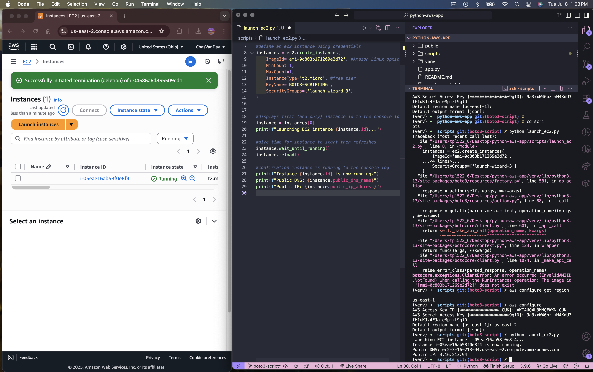
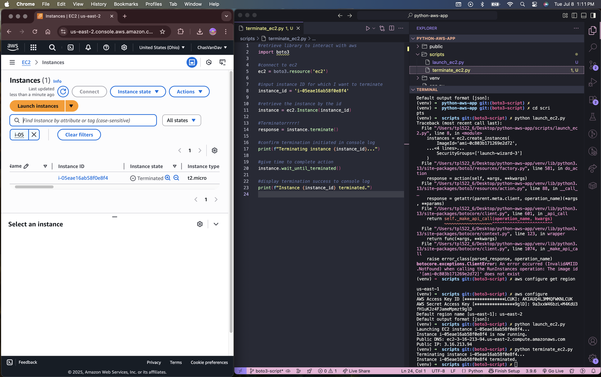

# Launching & Terminating an EC2 Instance via Boto3 Scripting

## Working from the CLI! 🥳

## Launching



## Terminating



# 🛠️ Setup Instructions

## 1. Clone the repository

```bash
git clone https://github.com/ChasVanDav/python-aws-app.git
cd python-aws-app
```

## 2. Create and activate a virtual environment

```bash
python3 -m venv venv
source venv/bin/activate
```

## 3. Install dependencies

```bash
pip install -r requirements.txt
```

## 4. Configure AWS credentials

Make sure you have [AWS CLI installed](https://docs.aws.amazon.com/cli/latest/userguide/install-cliv2.html), then run:

```bash
aws configure
```

You’ll be prompted to enter:

- **AWS Access Key ID**
- **AWS Secret Access Key**
- **Default region name** (e.g., `us-east-2`)
- **Output format** (e.g., `json`)

> These credentials must have permission to launch and terminate EC2 instances.

## 5. Launch an EC2 instance

```bash
cd scripts/
python launch_ec2.py
```

This will start a new EC2 instance using the configuration in the script.

## 6. Terminate the EC2 instance

Input the unique instance ID (e.g., `i-0abc123def456gh78`) from the launch output, then:

```bash
python terminate_ec2.py
```
